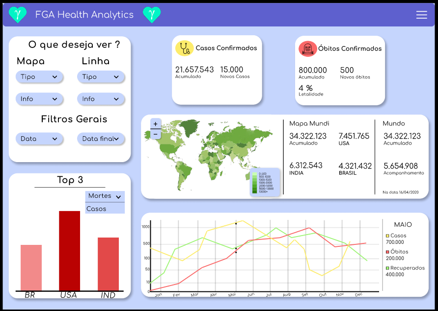

# FGA Health Analytics

Dashboard de acompanhamento dos índices de covid-19, em âmbito global e nacional, analisando os estados do Brasil.

---
# Resumo

O projeto consiste na criação de um dashboard a partir de estatísticas referentes aos óbitos e casos decorrente do vírus Covid-19.

Essa análise será feita em âmbito global analisando os países e em âmbito nacional, avaliando as regiões e estados do Brasil.  

Além disso, com essas informações traçaremos a letalidade do vírus e seu aumento ou queda com a variação do tempo.

Assim, temos como objetivo não somente a inserção dos dados de forma interativa, mas também, como forma de conscientizar o público que acessar nosso projeto.

---
# Fontes de Dados
Os datasets utilizados na construção desse projeto podem ser encontrados aqui:

- [Dataset Nacional](https://brasil.io/dataset/covid19/caso_full/)
- [Dataset Mundial](https://ourworldindata.org/coronavirus-source-data)

---
# Escopo do Projeto

**Produto**: Dashboard de acompanhamento da pandemia do Coronavírus.

**Cliente**: Disseminadores de informações.

**Público-Alvo**: Pessoas em geral interessadas em informações sobre a pandemia.

**Projetistas**:

- [Maurício Machado F. F.](https://gitlab.com/MauricioMachadoFF)
- Davi Bastos
- João Henrique
- João Paulo
- Juan Cerqueira
- Lara Giuliana
- Lavynia Fátima
- Marcos Bittar
- Mateus Vinícius
- Rafael Nobre

**Declaração sobre o problema**: A informação da pandemia do Coronavírus, embora existente e bem detalhada, chega ao público de forma fragmentada e pouco esclarecedora.

**Declaração sobre o projeto**: Levantamento de dados sobre o número de casos, óbitos decorrentes do vírus Covid-19.

---
# Projeto

Quer experimentar a experiência em primeira mão? Acesse: [Fga Health Analytics](https://www.youtube.com/watch?v=O1SPb_vLf0s)

